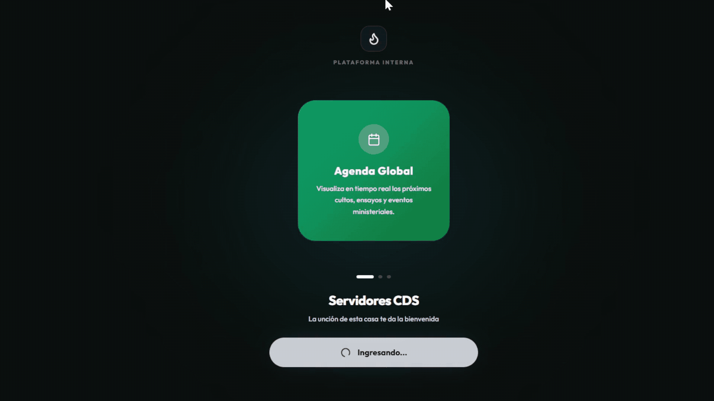

  

 

# ⛪ CDS App - Plataforma Comunitaria y Gestión de Equipos

**[ PROYECTO EN PRODUCCIÓN | +100 Usuarios Activos ]**

🔗 **Ver en vivo:** [Visitar la aplicación activa](LINK_DE_PRODUCCION_ACA)

CDS App es una plataforma móvil híbrida diseñada para digitalizar y centralizar la comunicación interna de congregaciones. Desarrollada con una arquitectura **Mobile-First**, la aplicación reemplaza la fricción y el ruido de los grupos de mensajería masiva por un entorno privado, estructurado y altamente escalable para la distribución de contenido y la gestión operativa de equipos.

## 🚀 El problema que resuelve

* **Ruido comunicacional:** Sustituye los chats desordenados por un muro social (Feed) categorizado, donde los anuncios urgentes, devocionales y pedidos de oración tienen su propio espacio protegido.
* **Falta de alcance inmediato:** A través de notificaciones Push segmentadas vía OneSignal, asegura que los avisos críticos o links de transmisión (Meet/YouTube) lleguen directamente a la pantalla del usuario.
* **Gestión de voluntarios:** Permite administrar los roles de los servidores (bienvenida, portería, altar, etc.), facilitando la logística de los servicios semanales.
* **Fricción en actualizaciones:** Al integrar distribución **OTA (Over-The-Air)**, el envío de correcciones de código o rediseños llega directamente al dispositivo del usuario sin depender de descargas manuales o tiempos de revisión en tiendas.

## ✨ Funcionalidades Core

* **Feed Interactivo & Stories:** Muro social con soporte para interacciones (reacciones nativas, comentarios) y carrusel superior para contenido efímero y devocionales destacados.
* **Notificaciones con Deep Linking:** Al tocar una alerta Push, el enrutamiento redirige al usuario exactamente a la publicación o evento mencionado en la base de datos.
* **Roles y Permisos Dinámicos (RBAC):**
  * *Administradores/Líderes:* Capacidad para fijar/archivar posts, gestionar usuarios y disparar campañas de notificaciones push manuales a segmentos específicos.
  * *Miembros:* Acceso a consumo de contenido, perfil personal interactivo y módulo de aprendizaje.
* **StudyHub (Academia):** Módulo LMS integrado para el consumo estructurado de clases, estudios bíblicos y herramientas financieras de la institución.

## 🛠️ Stack Tecnológico

* **Frontend & Interfaz:** React.js, Tailwind CSS (UI/UX premium).
* **Backend & BaaS:** Firebase (Authentication, Firestore Realtime Database, Cloud Storage).
* **Contenedor Móvil:** Capacitor (iOS/Android).
* **Infraestructura Cloud:** OneSignal (Push & Web SDK), Capgo (OTA Updater).
